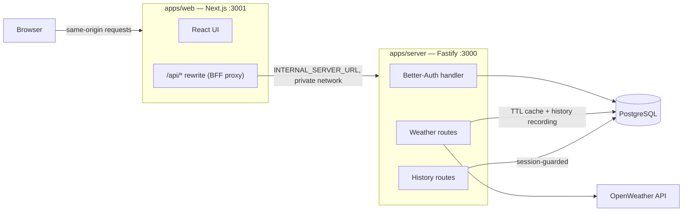

# Architecture

Design decisions, trade-offs, assumptions, and future improvements. See [REQUIREMENTS.md](REQUIREMENTS.md) for scope and status.

## System overview



- The browser only ever talks to the web app's origin. Requests to `/api/*` are transparently rewritten by Next.js to the Fastify server over the private network (`INTERNAL_SERVER_URL`).
- The Fastify server is the single intermediary to the external weather provider and owns all persistence.
- Both apps are containerised and deployed on Railway; the same topology runs locally via Docker Compose.

## Key decisions

### Monorepo

Single repository with pnpm workspaces and Nx task orchestration:

```
apps/web        Next.js front-end
apps/server     Fastify API
packages/db     Prisma schema, migrations, client
packages/auth   Better-Auth configuration
packages/env    Zod-validated environment schemas
packages/ui     Shared shadcn/ui components
packages/config Shared TS config
```

**Why a monorepo:** the front-end and back-end share types (API contracts, env schemas, auth types) with no publishing step; one set of tooling (Biome, Husky, TypeScript config); atomic commits across the stack; a single repo to clone and run. Nx adds task caching and orchestration (`nx run-many`) so builds and checks only re-run what changed.

**Trade-off:** more upfront structure than a two-folder repo, and workspace tooling (pnpm + Nx) is something reviewers/new contributors must be comfortable with.

### Scaffolding with Better-T-Stack

The project was scaffolded with [create-better-t-stack](https://github.com/AmanVarshney01/create-better-t-stack). It wires up modern tooling (monorepo layout, auth, ORM, linting, Docker) out of the box, which saved significant setup time and let the development effort go into the domain: the weather API, persistence, and the front-end experience.

**Trade-off:** some generated structure exists ahead of need, and the stack choices are partly inherited from the scaffold rather than picked one-by-one — the table below justifies each retained choice.

### Technology choices

| Technology | Role | Why |
|------------|------|-----|
| TypeScript | Language across the whole stack | _TODO_ |
| Next.js (App Router) | Front-end framework | _TODO_ |
| React | UI library | _TODO_ |
| Tailwind CSS | Styling | _TODO_ |
| shadcn/ui (`packages/ui`) | UI component primitives | _TODO_ |
| Fastify | Back-end HTTP framework | _TODO_ |
| Node.js | Server runtime | _TODO_ |
| PostgreSQL | Database | _TODO_ |
| Prisma | ORM and migrations | _TODO_ |
| Better-Auth | Authentication (email/password, sessions) | _TODO_ |
| Zod | Schema validation (env, API input) | _TODO_ |
| @t3-oss/env | Fail-fast environment variable validation | _TODO_ |
| TanStack Form | Form state and validation | _TODO_ |
| TanStack Query | Server-state management on the front-end | Declarative fetch lifecycle (loading/error/success) with caching, request de-duplication, and selective retries out of the box — replaces hand-rolled effect/state plumbing and keeps data logic out of presentational components |
| OpenWeather | External weather data provider | Clear API documentation and a large community/support ecosystem; free tier covers geocoding + current weather (see [Weather provider](#weather-provider-openweather)) |
| evlog | Structured request/error logging | _TODO_ |
| Nx | Monorepo task orchestration and caching | _TODO_ |
| pnpm workspaces | Package management | _TODO_ |
| Biome | Linting and formatting | _TODO_ |
| Husky + lint-staged | Pre-commit quality gates | _TODO_ |
| Docker + Compose | Containerisation, local full-stack runs | _TODO_ |
| Railway | Hosting (web, server, PostgreSQL) | _TODO_ |

### Weather provider: OpenWeather

Weather data comes from [OpenWeather](https://openweathermap.org): its geocoding API resolves free-text location searches to coordinates, and the current-weather API supplies conditions (both on the free tier). OpenWeather was chosen for its clearer API documentation and its larger community and support ecosystem compared with alternatives.

**Trade-off vs Open-Meteo:** Open-Meteo needs no API key at all, so choosing OpenWeather buys the documentation/community benefits at the cost of API-key management. That cost is contained by design: the key lives server-side only (`OPENWEATHER_API_KEY` in the server environment) and the browser never talks to the provider — all weather traffic goes through the Fastify API per the BFF section, so the key can never leak into the client bundle. Upstream responses are validated with lenient zod schemas and mapped to our own DTO, so the provider could be swapped without changing the client-facing contract.

### BFF reverse proxy (same-origin API)

The web app fronts the API using a backend-for-frontend pattern: a Next.js rewrite forwards `/api/:path*` to the Fastify server (`next.config.ts`), addressed via `INTERNAL_SERVER_URL` over the private network.

**Why:** session cookies only work reliably when the API is on the same domain as the page — with a separate public API URL, cookies become third-party and run into browser restrictions. Proxying makes every browser request same-origin, so the session cookie stays first-party (`httpOnly`, `secure`, `sameSite=lax`), there is no CORS complexity in the browser, and the API's location is not baked into the client bundle. It is also simple: one rewrite rule, no extra infrastructure.

In a larger system the BFF would typically be its own layer — a tRPC or GraphQL server tailored to the front-end — sitting in front of domain APIs running as separate microservices (weather, auth, etc.). Here, Fastify serves as the BFF directly, and auth plus all subsequent routes live in that one service. This is a deliberate delivery-focused choice: one service to build, test, deploy, and reason about, with the same-origin/cookie benefits of the pattern intact. The seams are still in place — routes are modular within Fastify, so a domain could be extracted into its own service behind a dedicated BFF later without changing what the browser sees.

**Consequences:**

- There is no `NEXT_PUBLIC_SERVER_URL`; the client calls relative `/api/...` paths and only the web app's server environment knows where the API lives (`INTERNAL_SERVER_URL`).
- Server-side rendering calls the API directly over the private network with the same variable (see `apps/web/src/lib/auth-client.ts`).
- **Trade-off:** browser traffic takes an extra hop through the Next.js server, adding a small amount of latency and coupling API availability to the web app's proxy. Acceptable at this scale; a shared edge/API gateway would replace it if the apps needed to scale independently.

### Containerised deployment

Both apps are packaged as Docker containers (`apps/*/Dockerfile`, with the Next.js app built in standalone output mode), composed together with PostgreSQL in `docker-compose.yml`.

**Why:** the REST API requirement means the back-end is a long-running service in its own right, which maps naturally to a container rather than to per-app serverless/platform-specific deployments. Containerising everything keeps deployment uniform and portable: the whole application — web, API, and database — runs with a single `docker compose up` locally, and the same images deploy to any provider that runs containers (Railway in this case) without provider-specific build tooling. One deployment model for all parts of the app is simpler to reason about than a different pipeline per app.

**Scope:** container *scaling* (orchestration, replicas, autoscaling) is deliberately not a concern at this stage — the containers are treated as single instances. The stateless-API design keeps horizontal scaling available later (see [Scaling approach](#scaling-approach)), but nothing in the current setup is built for it.

### Pre-commit quality gates instead of CI (for now)

Every commit runs lint/format (Biome via lint-staged) **and the full test suite** (`nx run-many -t test`) through the husky pre-commit hook.

**Why:** with a single developer and no shared branches yet, a pre-commit test run is an easy CI alternative — it gives the core CI guarantee (no commit lands with failing tests) with zero infrastructure. Nx's computation caching keeps it fast: projects unaffected by the commit replay cached results rather than re-running.

**Trade-off:** hooks run on the developer's machine and can be skipped (`--no-verify`), and nothing validates the pushed state or fresh-clone builds. That is what a real CI pipeline adds, and it remains the first item under [Future improvements](#future-improvements); this hook is the stopgap, not the end state.

### Data and persistence

- Schema is managed by Prisma migrations (`prisma migrate dev` locally, `prisma migrate deploy` in production) — the migration history in `packages/db/prisma/migrations` is the source of truth, not `db push`.
- Auth tables (user, session, account, verification) are owned by Better-Auth's Prisma adapter.
- Domain models (implemented, `packages/db/prisma/schema/app.prisma`): a **weather cache** table (`weather_cache`: key → JSON payload + `expiresAt`) and per-user **search history** (`search_history`, cascade-deleted with the user). PostgreSQL was chosen over Redis for the cache to keep a single datastore at this scale; the cache sits behind a small `CacheStore` interface (`get`/`getStale`/`set` in `apps/server/src/lib/cache.ts`), so a Redis implementation is a drop-in swap without touching callers.

**Weather cache strategy** (`apps/server/src/modules/weather/weather.constants.ts`):

- **Keys and granularity**: geocode lookups are cached as `geo:v1:{query, trimmed + lowercased}`; current weather as `wx:v1:{lat}:{lon}` with coordinates rounded to 2 dp (~1 km), so nearby queries share one entry. The cached payload is the mapped DTO, never the raw upstream body.
- **TTLs**: 10 minutes for current weather (freshness on the order of minutes is acceptable, see Assumptions), 24 hours for geocoding (places don't move).
- **Expiry and cleanup**: expiry is checked lazily on read; expired rows are retained for a stale window (24 h) and deleted lazily only beyond it, so they stay available as a fallback. A periodic sweep of long-expired rows is a noted future improvement.
- **Stale-on-upstream-failure**: when OpenWeather fails (502/504 paths) and an expired entry exists, the API serves it instead of the error. Cache behaviour is surfaced per response via the `x-cache: HIT | MISS | STALE` header on `GET /api/v1/weather`.
- **Invalidation**: TTL-based. Keys are versioned (`v1`), so a change to the cached shape busts the cache by bumping the version — no flush needed. Cached payloads are also re-validated against the DTO zod schema on read; a corrupt/outdated payload degrades to a cache miss, never a 500.
- **Failure isolation**: every cache call goes through a safe wrapper — a thrown cache error is logged and treated as a miss, so cache trouble can never break a weather request.

**Search history**: recorded server-side after each successful weather fetch for signed-in users only (anonymous searches are never stored). A consecutive repeat of the same coordinates updates the existing row (timestamp + raw query) instead of inserting; storage is capped at the newest 50 rows per user (older rows evicted on insert). `GET /api/v1/history` returns the newest 10; `DELETE /api/v1/history/:id` is filtered by owner and returns 404 for anything else (never revealing other users' ids). Recording failures are logged and never fail the weather response.

**Testing seam**: the cache (`CacheStore`), history storage (`HistoryRepo`), and session resolution are injected into `buildApp()`, so route tests run with in-memory fakes and stubbed sessions — no test needs a running PostgreSQL or a real session. The trade-off: the Prisma implementations themselves are exercised against stubs, not a real database; DB integration tests via a CI service container are a known gap (see Future improvements).

### Database access and least privilege

The application currently connects with the database's main credentials. That is a conscious simplification for delivery at this scale, and it is the first thing that would change when hardening or scaling:

1. **Split runtime from migrations** (applies even to the current single service): the app connects with a role granted DML only (`SELECT`/`INSERT`/`UPDATE`/`DELETE` on the app tables), while `prisma migrate deploy` runs with a separate role that holds DDL rights. A compromised runtime credential then cannot alter the schema or drop tables.
2. **Per-service roles**: if services are split out (see the BFF section), each gets its own credential scoped to the tables it owns — enabling revocation, audit attribution, and blast-radius containment per service.
3. **Auth data ownership**: were the auth service separated, it would become the sole owner of the auth tables (user, session, account, verification) — not just the only writer. Other services would obtain identity from the session/token via the auth service's API rather than reading its tables, because direct cross-service table reads couple every consumer to auth's schema migrations. Schema-per-service (and eventually database-per-service) enforces this ownership by topology rather than by grants.

### API hardening (rate limiting, security headers, health check)

**Rate limiting** (`@fastify/rate-limit`): a global limit of **100 requests / minute per client IP** on every route (constants in `apps/server/src/lib/rate-limit.ts`; `max`/`timeWindow` injectable via `buildApp` for tests). Exceeding it returns **429 on the standard `{ error: { code: "RATE_LIMITED", message } }` envelope** — the plugin *throws* the value produced by its `errorResponseBuilder`, so the builder returns an `AppError` and the shared error handler keeps every non-2xx response, 429 included, on one envelope. The standard `retry-after` and `x-ratelimit-*` headers stay enabled.

- **`trustProxy: true` is required** for per-IP limiting to mean anything here: the browser reaches Fastify only through the Next.js BFF rewrite, and in production both sit behind Railway's edge proxy. Without it every request resolves to the proxy's IP and the "per-IP" limit collapses into one shared bucket; with it, `request.ip` is taken from `x-forwarded-for` (verified live through the dev proxy).
- **The counter store is in-memory, per instance** — a deliberate trade-off matching the single-instance deployment. Horizontal scaling would multiply the effective limit by the instance count and reset counters on deploy; the fix is the plugin's Redis-backed store, the same shared-state move already described in [Scaling approach](#scaling-approach). Per-user (rather than per-IP) limits for authenticated routes are a further improvement, not built now.
- **Auth endpoints**: Better-Auth ships its own rate limiting — enabled by default in production (disabled in dev), 100 req/60 s per IP in-memory, with stricter built-in rules for sensitive paths (e.g. `/sign-in/email`: 3 req/10 s). `/api/auth/*` also sits under the global Fastify limit; the two compose rather than conflict (Better-Auth's stricter windows bite first on brute-force patterns).

**Security headers**: `@fastify/helmet` with defaults on the API (nosniff, frame denial, etc. — a JSON API needs no CSP tuning). The Next.js app sets a minimal set via `headers()` in `next.config.ts`: `X-Content-Type-Options: nosniff`, `X-Frame-Options: DENY`, `Referrer-Policy: strict-origin-when-cross-origin`. A strict CSP for the web app is a future improvement — Next's inline runtime makes it a project of its own.

**Health check**: `GET /health` (in `apps/server/src/lib/health.ts`) runs a `SELECT 1` DB ping bounded by a 2 s timeout, returning 200 `{ status: "ok" }` or 503 `{ status: "degraded", checks: { database: "down" } }`. The 503 body intentionally does **not** use the error envelope: it is a machine-readable health document for Docker/Railway probes, not a client-facing API error. The route is exempt from rate limiting (it is polled), its responses are never cached, and the docker-compose healthcheck targets it (the Railway healthcheck path should be set to `/health` in the service settings).

### API documentation (OpenAPI generated from the route schemas)

The OpenAPI 3.1 spec is **generated from the zod route schemas** — the same schemas that validate and serialize every request/response at runtime — via `@fastify/swagger` + `fastify-type-provider-zod`'s transforms (registered in `buildApp()`, config in `apps/server/src/lib/openapi.ts`). Docs therefore cannot drift from the implementation: the spec *is* the route contract.

- **Committed spec + drift test standing in for CI**: `pnpm run docs:generate` writes the spec to `apps/fumadocs/openapi/weather-api.json` (built with in-memory fakes — no DB, network, or env needed) and regenerates the Fumadocs MDX pages from it. A drift test (`apps/server/src/openapi.test.ts`) rebuilds the spec in-memory and compares it against the committed file, so a schema change without regeneration fails the pre-commit suite — the same stopgap-for-CI role as the pre-commit hooks above.
- **Rendered by Fumadocs, not by the server**: the Fastify app exposes no live docs UI; the docs app (`apps/fumadocs`, `pnpm nx dev fumadocs` on port 4000) renders the committed spec with `fumadocs-openapi`, plus hand-written pages for authentication, errors, and rate limits. `/api/auth/*` is excluded from the spec — it is Better-Auth's surface, documented by a hand-written page (Better-Auth's own OpenAPI plugin is the future path for generating those).
- **Deployed on Railway alongside the other apps.** The docs app forwards the public API surface (`/api/v1/*`, `/health`) to the Fastify server over the private network via a Next.js rewrite driven by `INTERNAL_SERVER_URL` — the same BFF mechanism the web app uses — so the interactive playground works same-origin (the API's CORS only allows the web app's origin). The rewrite deliberately excludes `/api/auth/*` (not the docs' business) and leaves `/api/search` to the docs app's own search handler. Session-guarded endpoints return their 401 envelope from the playground, since sessions live on the web app's origin.

## Assumptions

- Small user base and a single deployment region; no high-availability requirements.
- The external weather provider is generally available; on upstream failure the API degrades gracefully with a meaningful error (and can serve stale cache where present) rather than retrying aggressively.
- Weather data freshness on the order of minutes is acceptable (drives the cache TTL).
- No PII is stored beyond email address and name for authentication.
- Modern evergreen browsers; no legacy browser support.

## Future improvements

With more time, in rough priority order:

1. **CI pipeline** (GitHub Actions): lint, type-check, and test on every push — including DB integration tests for the Prisma cache/history implementations against a PostgreSQL service container (currently exercised via stubs only).
2. **Forecast and favourites** — extend the weather provider client and add a favourites model reusing the protected-endpoint pattern from search history.
3. **E2E coverage** — a Playwright happy path (register → search → see weather → revisit history).
4. **Observability** — metrics (request duration, upstream latency, cache hit rate) on top of the existing structured logging.
5. **Password reset / email verification** to round out the auth story.
6. **Cache maintenance** — a periodic sweep of long-expired `weather_cache` rows (cleanup today is lazy, on read).
7. **Strict CSP for the web app** — the API ships helmet defaults, but a meaningful `Content-Security-Policy` for the Next.js app needs nonce/hash work around its inline runtime.

## Scaling approach

The current design targets the assignment's scale; the path beyond it:

- **Stateless API**: the Fastify server keeps no in-process state (sessions are in PostgreSQL, cache in PostgreSQL), so it can scale horizontally behind a load balancer today.
- **Cache**: move the weather cache (and rate-limit counters) to Redis so instances share state and reads stop hitting PostgreSQL.
- **Database**: connection pooling (e.g. PgBouncer) ahead of read replicas; search history is append-heavy and trivially partitionable by user.
- **Edge**: replace the Next.js rewrite with a CDN/edge gateway routing `/api/*` and static assets independently, decoupling web and API scaling.
- **Provider limits**: the server-side cache already amortises external API calls; a request coalescer (single flight per location) would cap upstream traffic under burst load.
